# Opinionation

[Link to live Site](https://opinionation.herokuapp.com/)

Opinionation is a website that allows users to read and share their opinions on various movies and TV shows. The website is designed to be user-friendly and easy to navigate, with several key elements that make it stand out.

## UX

### Navbar

The navbar is located at the top of the website and contains links to different sections of the website. It includes the Opinionation logo on the left side which doubles as the "Home" button, followed by links to "Home" "Log in" or "Register". On the right hand side is a short slogan to emphasize the reason for the website.

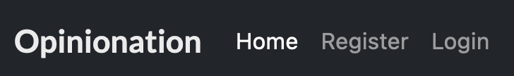

When the user has logged in using the "Log In" link, the "Log In" and "Register" links disappear, and are instead replaced with a single "Log Out" link.

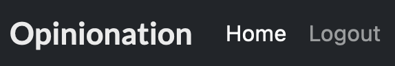

If the user is an Admin after logging in, they are presented with the same log out link, but instead on the right there is an extra "Create Post" button which I will go in more depth further down. 

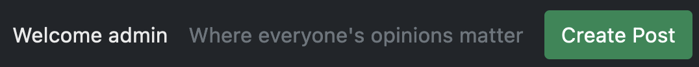

Also next to the slogan when the user has logged in, there is a small "Welcome *name*" shown to the currently logged in user to display their username within the message.

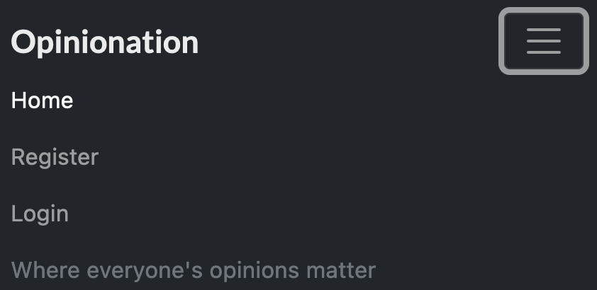

The navbar is also fully responsive so that on mobile devices the links become a burger link.

### Hero Image

The hero image is a large banner that spans the width of the website, located below the navbar. It features an simple image of a cinema audience with a short headline that is another simple slogan for the website. It also has a pan effect where it stays still while scrolling up and down the page.

### Posts

The website's main content consists of posts written by the admin on movies or TV shows. Each post has a title, the author's name, the date of publication, the streaming services, a short summary, a like/dislike button, a like/dislike ratio, and the number of comments within the post. Clicking on a post takes users to the full article where they can read the entire post, leave comments and like/dislike the post and view all the things mentioned above.

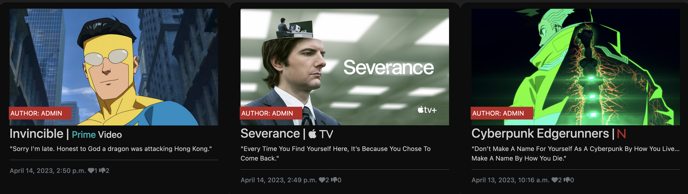

### Footer

The footer is located at the bottom of the website and contains links to the website's social media pages, including Twitter, Facebook, and Instagram. It also includes a simple "Made by Rob Sizeland".

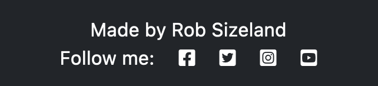

## Create Post Page

On the Create Post page that only the Admin has access to, there will be numerous boxes that they can fill in. 

- Title
- Slug
- Content
- Image
- Excerpt 
- Status
- Streaming Service
- Create Post Button

Once they have decided all the boxes have been filled in to their requirements, the post will show up on the homepage and it will automatically redirect the Admin to the post page.

## Post Detail Page

When the user clicks one of the posts on the main page it will bring them to the detailed version of the post. This will include:

- The image the Admin decided to upload when creating the post
- The post title
- The author of the post
- The time the post was created
- The description (excerpt)
- The Like/Dislike buttons
- The Like/Dislike ration
- The number of comments
- The comments with username and time of comment

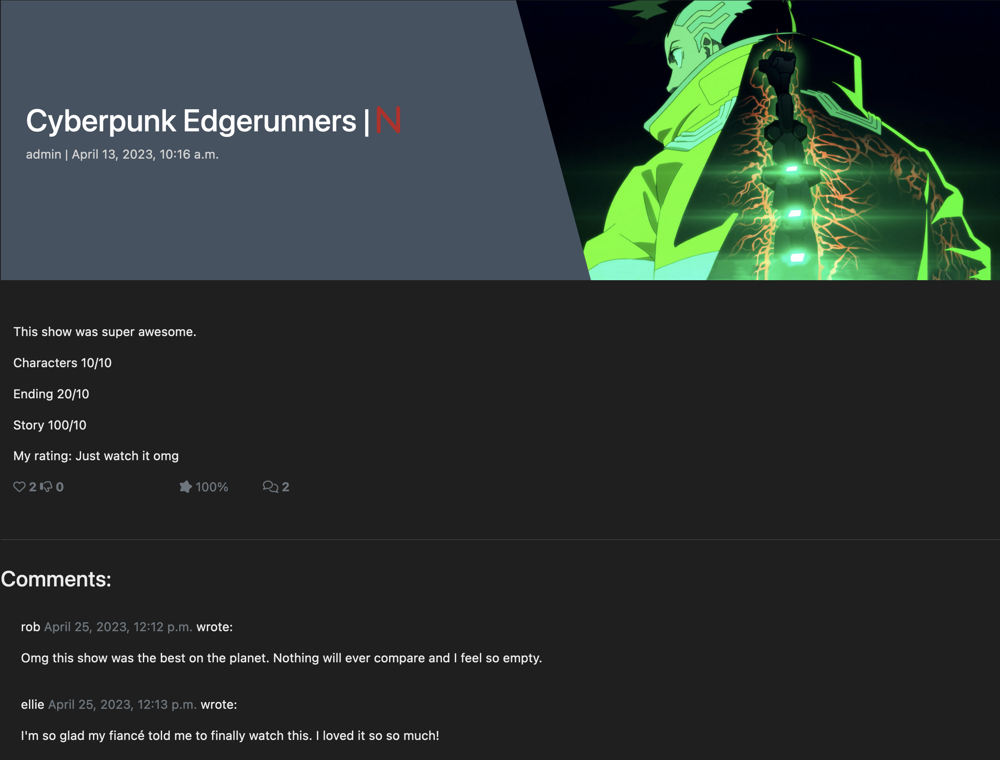

### Comment box

If the user is logged in then a comment box will appear to the right of the comments to allow them to comment.

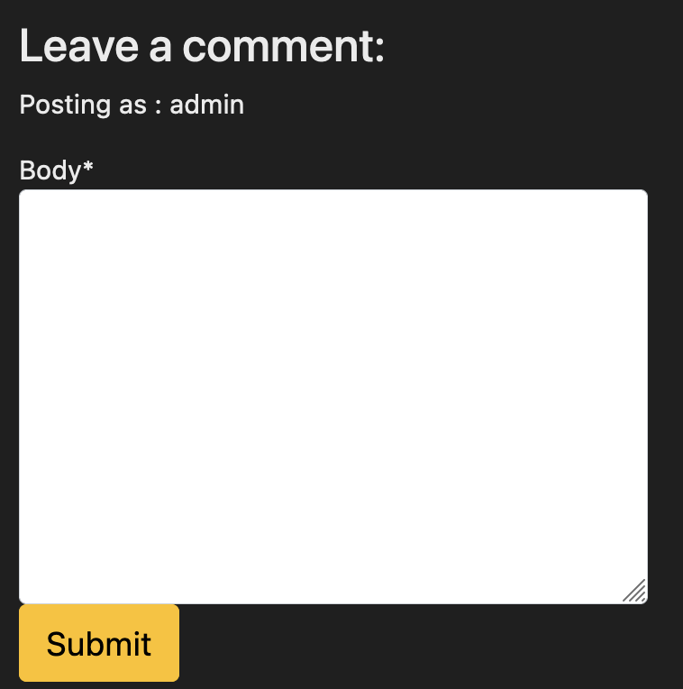

### Edit Post Page

Also, if the user is the Admin, then they will get an extra button under the title to allow them to edit the post.

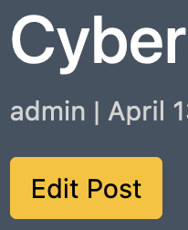

Within the Edit Page the Admin is able to view all the current content that is displayed on the page, as well as a Save, Cancel and Delete buttons.

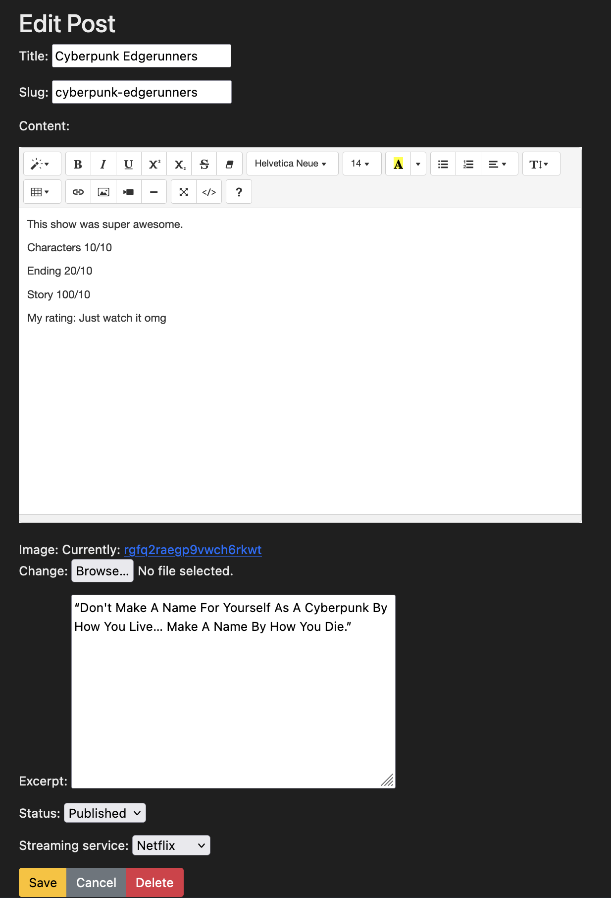

### Delete Post Page

Choosing the Delete option will take the Admin to a confirm page. Just to stop any accidental deletions from happening. Clicking No will take the user back to the post detail page.

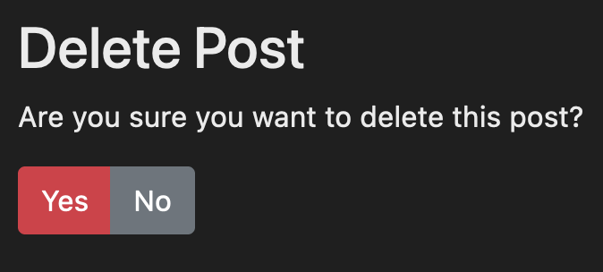

### User Comment

If the user is logged in and as made a comment. They will be able to see a Edit and Delete link under each of their comments.

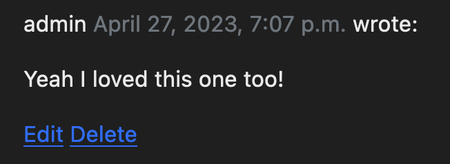

### Edit Comment Page

Choosing the Edit will take the user to a page with their comment currently populated with what was in there and allow them to edit the comment to whatever they choose.

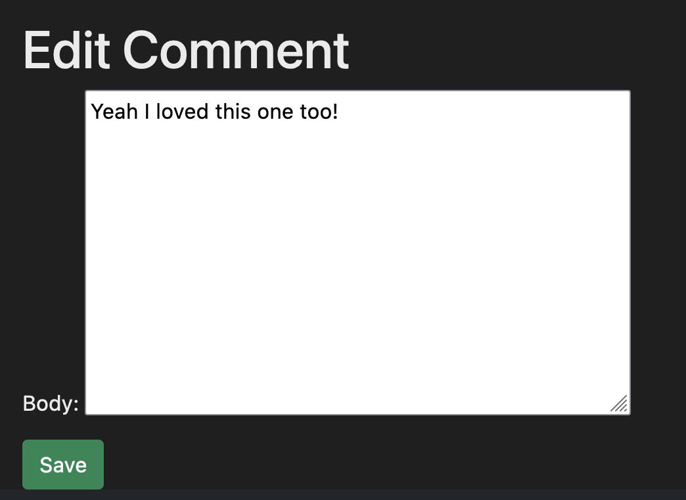

### Delete Comment Page

Choosing Delete will also take the user to a page to confirm their decision just in case their choice was made in error.

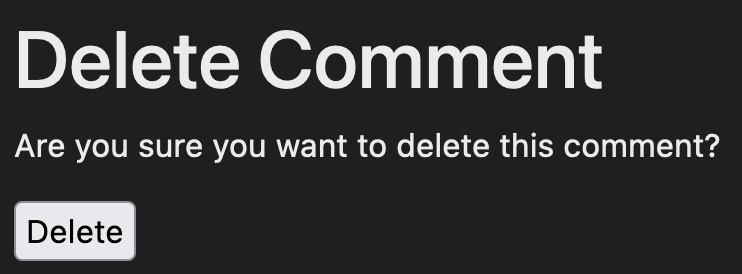

Doing either an Edit or Delete will take the user back to the current post they were looking at.

### Register PAge

If the user clicks the Register option at the top of the page it will send them to a page to sign up for an account which takes:
- Username
- Email (Optional)
- Password
- Password again for confirmation

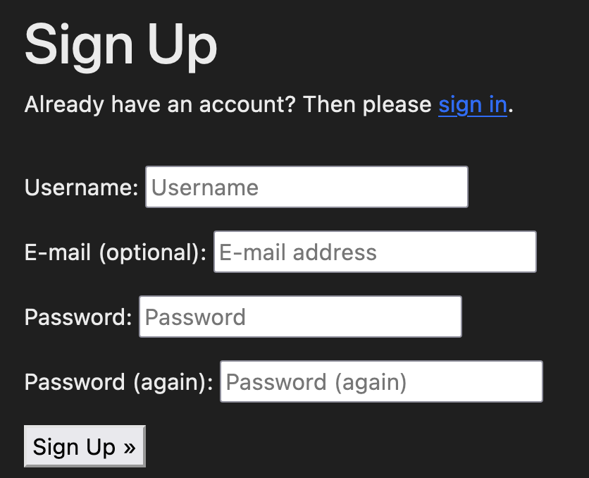

### Login Page

If the user clicks the Login option at the top of the page it will send them to a page to login to their already created account. If they accidently clicked on this page or thought they already had an account, there is a link to the sign up page within the paragraph too.

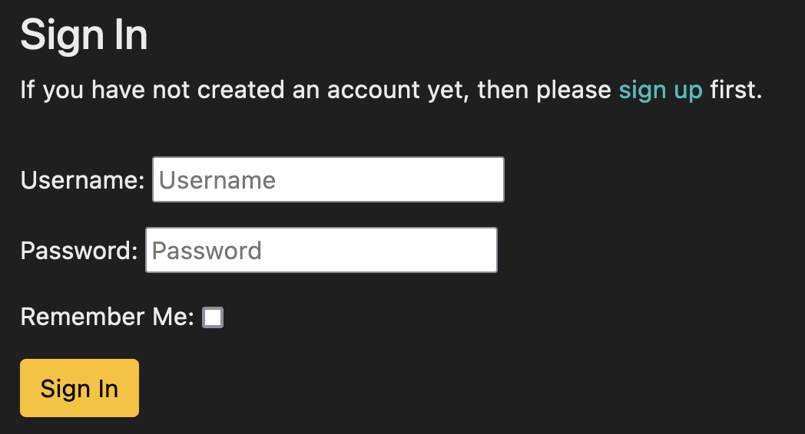

### Django Admin Panel

If the administrator needs, there is a Django admin page they can go to by adding admin to the end of the homepage url. They shouldn't need to as all the functionality is available within the frontend of the website.

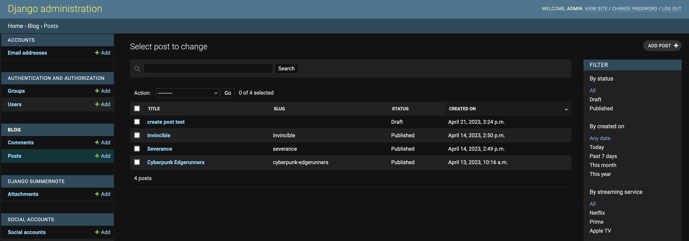

## System Message

Upon log in, there is a system message that pops up and disappears over a few seconds. This message is a successful one with the users username.

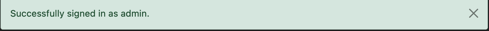

There is also a sign out message for when the user signs out.

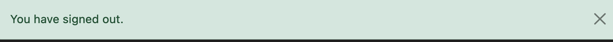

## Technologies Used

Languages Used:

- HTML5
- CSS
- JavaScript
- Python

### Frameworks and Libraries Used:

### Software and Web Applications Used:

## Testing

### Browser Testing

### Responsiveness

### Validator Testing

#### W3C Markup Validator:

#### W3C CSS Validator:

#### JSHint:

#### PEP8 Online:

#### Lighthouse:

### Automated Testing

#### Jest:

#### Django testing tools:

### User Stories testing

The application was deployed to Heroku. The steps to deploy are as follows:

  - Login to [Heroku](https://dashboard.heroku.com/apps) dashboard to get an overview of installed apps.
  - Click on New => Create new app.
  - Choose a name for your application (must be unique) and enter your location.
  - Click on Create app.
  - After creating your new application, navigate and click on the Resources tab.
  - In the Add-ons search bar enter Heroku Postgres => Select Heroku Postgres.
  - A pop-up window till appear, choose Plan name Hobby Dev - Free.
  - Click on Submit order form.
  - Navigate to the Settings tab => click on Reveal Config Vars.
  - Copy the DATABASE_URL url value to the clipboard.
  - In GitPod => Create a new env.py file on top level directory.
  - In the env.py file:
    - Set environment variables: os.environ[”DATABASE_URL"] = "Paste in Heroku DATABASE_URL Link”
    - Add in secret key: os.environ[”SECRET_KEY"] = "Make up your own randomSecretKey”
  - In Heroku => Navigate to the Settings tab => click on Reveal Config Vars.
  - Add SECRET_KEY to Config Vars with the randomSecretKey value previously chosen.
  - In the settings.py file:
    - Remove the insecure secret key and replace it with: SECRET_KEY = os.environ.get(’SECRET_KEY')
    - Update to use the DATABASE_URL: dj_database_url.parse(os.environ.get(”DATABASE_URL"))
  - Save all files and Make Migrations: python3 manage.py migrate
  - Login to [Cloudinary](https://cloudinary.com/) and navigate to the Cloudinary Dashboard.
  - Copy your CLOUDINARY_URL API Environment Variable to the clipboard.
  - In the env.py file:
    - Add Cloudinary URL: os.environ["CLOUDINARY_URL"] = ”cloudinary://paste in API Environment Variable”
  - In Heroku => Navigate to the Settings tab => click on Reveal Config Vars.
  - Add ’CLOUDINARY_URL’ to Config Vars with the in API Environment Variable value.
  - Add ’DISABLE_COLLECTSTATIC’ 1 to Heroku Config Vars (temporary, must be removed before final deployment).
  - In the settings.py file:
    - Add Cloudinary Libraries to installed apps (note: order is important) ’cloudinary_storage',  ’django.contrib.staticfiles', ’cloudinary',
    - Add the following code below STATIC_URL = ’/static/' to use Cloudinary to store media and static files:
      - STATICFILES_STORAGE = ’cloudinary_storage.storage.StaticHashedCloudinaryStorage'
      - STATICFILES_DIRS = [os.path.join(BASE_DIR, ’static')]
      - STATIC_ROOT = os.path.join(BASE_DIR, ’staticfiles')
      - MEDIA_URL = '/media/'
      - DEFAULT_FILE_STORAGE = 'cloudinary_storage.storage.MediaCloudinaryStorage'
    - Link file to the templates directory in Heroku: TEMPLATES_DIR = os.path.join(BASE_DIR, ’templates')
    - Change the templates directory to: TEMPLATES_DIR: 'DIRS': [TEMPLATES_DIR],
    - Add Heroku Hostname to ALLOWED_HOSTS: ALLOWED_HOSTS = [”Your_Project_name.herokuapp.com”, ”localhost”]
  - Create 3 new folders on top level directory: media, static, templates
  - Create a Procfile on the top level directory
  - In the Procfile file:
    - Add the following code with your project name: web: gunicorn PROJ_NAME.wsgi
  - In the terminal: Add, Commit and Push.
  - In Heroku navigate to the Deploy tab => click on Deploy Branch.
  - When build process is finished click on Open App to visit the live site.