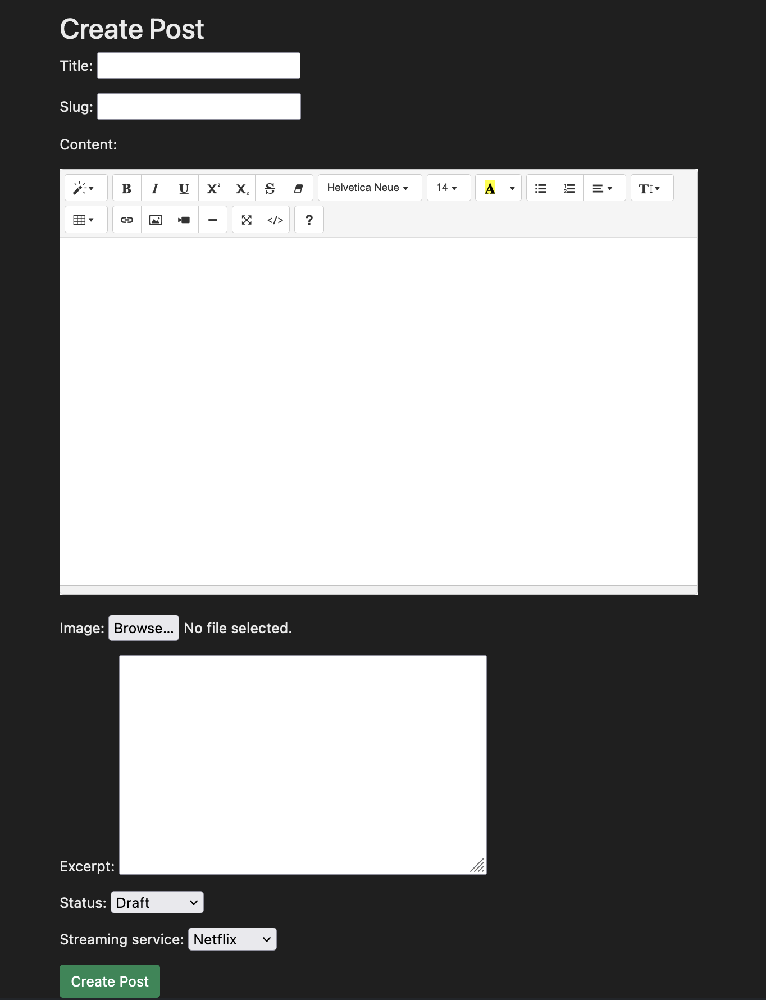

# Opinionation

[Link to live Site](https://opinionation.herokuapp.com/)

Opinionation is a website that allows users to read and share their opinions on various movies and TV shows. The website is designed to be user-friendly and easy to navigate, with several key elements that make it stand out.

## UX

### Navbar

The navbar is located at the top of the website and contains links to different sections of the website. It includes the Opinionation logo on the left side which doubles as the "Home" button, followed by links to "Home" "Log in" or "Register". On the right hand side is a short slogan to emphasize the reason for the website.

When the user has logged in using the "Log In" link, the "Log In" and "Register" links disappear, and are instead replaced with a single "Log Out" link.

If the user is an Admin after logging in, they are presented with the same log out link, but instead on the right there is an extra "Create Post" button which I will go in more depth further down. 

Also next to the slogan when the user has logged in, there is a small "Welcome *name*" shown to the currently logged in user to display their username within the message.

The navbar is also fully responsive so that on mobile devices the links become a burger link.

### Hero Image

The hero image is a large banner that spans the width of the website, located below the navbar. It features an simple image of a cinema audience with a short headline that is another simple slogan for the website. It also has a pan effect where it stays still while scrolling up and down the page.

### Posts

The website's main content consists of posts written by the admin on movies or TV shows. Each post has a title, the author's name, the date of publication, the streaming services, a short summary, a like/dislike button, a like/dislike ratio, and the number of comments within the post. Clicking on a post takes users to the full article where they can read the entire post, leave comments and like/dislike the post and view all the things mentioned above.

### Footer

The footer is located at the bottom of the website and contains links to the website's social media pages, including Twitter, Facebook, and Instagram. It also includes a simple "Made by Rob Sizeland".

## Create Post Page

On the Create Post page that only the Admin has access to, there will be numerous boxes that they can fill in. 

- Title
- Slug
- Content
- Image
- Excerpt 
- Status
- Streaming Service
- Create Post Button

Once they have decided all the boxes have been filled in to their requirements, the post will show up on the homepage and it will automatically redirect the Admin to the post page.

## Post Detail Page

When the user clicks one of the posts on the main page it will bring them to the detailed version of the post. This will include:

- The image the Admin decided to upload when creating the post
- The post title
- The author of the post
- The time the post was created
- The description (excerpt)
- The Like/Dislike buttons
- The Like/Dislike ration
- The number of comments
- The comments with username and time of comment

### Comment box

If the user is logged in then a comment box will appear to the right of the comments to allow them to comment.

### Edit Post Page

Also, if the user is the Admin, then they will get an extra button under the title to allow them to edit the post.

Within the Edit Page the Admin is able to view all the current content that is displayed on the page, as well as a Save, Cancel and Delete buttons.

### Delete Post Page

Choosing the Delete option will take the Admin to a confirm page. Just to stop any accidental deletions from happening. Clicking No will take the user back to the post detail page.

### User Comment

If the user is logged in and as made a comment. They will be able to see a Edit and Delete link under each of their comments.

### Edit Comment Page

Choosing the Edit will take the user to a page with their comment currently populated with what was in there and allow them to edit the comment to whatever they choose.

### Delete Comment Page

Choosing Delete will also take the user to a page to confirm their decision just in case their choice was made in error.

Doing either an Edit or Delete will take the user back to the current post they were looking at.

### Register PAge

If the user clicks the Register option at the top of the page it will send them to a page to sign up for an account which takes:
- Username
- Email (Optional)
- Password
- Password again for confirmation

### Login Page

If the user clicks the Login option at the top of the page it will send them to a page to login to their already created account. If they accidently clicked on this page or thought they already had an account, there is a link to the sign up page within the paragraph too.

### Django Admin Panel

If the administrator needs, there is a Django admin page they can go to by adding admin to the end of the homepage url. They shouldn't need to as all the functionality is available within the frontend of the website.

## System Message

Upon log in, there is a system message that pops up and disappears over a few seconds. This message is a successful one with the users username.

There is also a sign out message for when the user signs out.

## Technologies Used

Languages Used:

- HTML5
- CSS
- JavaScript
- Python

### Frameworks and Libraries Used:

- [Bootstrap:](https://getbootstrap.com/) Bootstrap CSS Framework used for styling and to build responsive web pages.
- [FontAwesome:](https://fontawesome.com) FontAwesome for all the icons such as the like, dislike buttons. 
- [Cloudinary:](https://cloudinary.com/) Used to store all blog images and uploaded images.
- [Django:](https://www.djangoproject.com/) Main Python framework used in the development.
- [Django Allauth:](https://django-allauth.readthedocs.io/en/latest/index.html) Used for authentication and account registration.
- [Django Crispy Forms:](https://django-crispy-forms.readthedocs.io/en/latest/) Used to simplify the rendering of Django forms.
- [dj_database_url:](https://pypi.org/project/dj-database-url/) Used to allow database urls to connect to the postgres database.
- [Gunicorn:](https://gunicorn.org/) Green Unicorn, used as the Web Server to run Django on Heroku.
- [psycopg2:](https://pypi.org/project/psycopg2/) Used PostgreSQL database adapter.
- [Summernote:](https://github.com/summernote/django-summernote) To provide a WYSIWYG editor for customizing new blog content and add images.

### Software and Web Applications Used:

- [Am I Responsive:](http://ami.responsivedesign.is) Checking the responsive.
- [Chrome DevTools:](https://developer.chrome.com/docs/devtools/) Used to test the response on different screen sizes, debugging and to generate a Lighthouse report to analyze page load.
- [Font Awesome:](https://fontawesome.com/) Used throughout the site to add icons for aesthetic and UX purposes.
- [Git:](https://git-scm.com/) Git was used for version control by utilizing the Gitpod terminal to commit to Git and Push to GitHub.
- [GitHub:](https://github.com/) GitHub is used to store the projects code after being pushed from Git and to create the Kanban board used for this project.
- [Google Fonts:](https://fonts.google.com/) To import font family ’Cabin Sketch’ which is used throughout the site. Added fallback font sans-serif.
- [Heroku:](https://www.heroku.com/) For deployment and hosting of the application.
- [Heroku PostgreSQL:](https://www.heroku.com/postgres) The database used for this application.
- [HTML Validator:](https://validator.w3.org/) Check your code for HTML validation.
- [JSHint:](https://jshint.com/) Check code for JavaScript validation.
- [W3 CSS Validator:](https://jigsaw.w3.org/css-validator/) Check your code for CSS validation.

## Testing

### Browser Testing

I have thoroughly tested this website to ensure optimal performance and compatibility. Our tests have been carried out on popular web browsers including:

- Google Chrome 
- Mozilla Firefox
- Safari

All of which have been found to work seamlessly with the site. Additionally, I have also tested the website on an iPhone 13 Pro, and can confirm that it is fully responsive and functions as intended on mobile devices."

### Responsiveness

Chrome developer tool have been used to check the responsiveness.

  - I have tested that this application works on different screen sizes from iPhone 5 (320px wide) and very large screens like 5K iMac Pro (5120 x 2880 px).

### Validator Testing

#### W3C Markup Validator:

I have checked all the pages to see if the HTML code is without errors. I have omitted the Django code from the files as that would cause errors unrelated to the HTML code itself. 

#### W3C CSS Validator:

#### JSHint:

#### PEP8 Online:

Since Pep8Online's domain has been taken over there doesn't seem to be an equivalent website for the check so the closest I was able to get was a syntax checker.

### Forms.py

### Models.py

### Admin.py

### Urls.py

### Views.py

### Manual testing

 Test Label    | Test Action   | Expected Outcome  | Test Outcome |
 |---------------|---------------|-------------------|--------------|
 | Home Page    | Open website | The url brings you to the main homepage that has all the posts on. | PASS  | --------------------------------
| Register Link | Click the Register Link | Brings the user to the sign up url where they can input a username, email and password to log in with  | PASS  | 
| Login Link | Click the Login Link | Brings the user to the login url where they can put their username and password to log into their account | PASS |
About Us Link | Click the About us Link | Brings the user to the about-us url to display the owner of the website | PASS 
| Post Detail links | User clicks a post link | Brings the user to the relevant post detail for the movie/tv show they wanted a more detailed view of, perhaps to see the details as well | PASS 
| Create a post | Admin must be logged in  | When the Admin is logged in they will see a Create Post button in the top right to add a new post to the website | PASS
| Edit a post | Admin must be logged in and viewing a post | On the post there is a button to bring the Admin to the Edit page where they can make changes and save them. As well as cancel | PASS | 
Delete a post | Admin must be logged in and viewing a post | On the post there is a button to bring the Admin to the Edit page where they can scroll to the bottom to find a Delete button. Upon clicking it takes them to a page to confirm the deletion process | PASS
| Add a comment | A user must be logged in and viewing a post | On the post there is a comment box to allow the user to add a comment to the page they're currently on. Upon submitting the page refreshes, thanks them for the comment and they can see the comment on the page | PASS
| Edit a comment | A user must be logged in and viewing a post | On the post there is a comment list the user can see. If one or more of their comments are there, they are able to click the Edit link beneath their comment. This takes them to a page to edit their comment where they can save the changes or cancel | PASS
| Delete a comment | A user must be logged in and viewing a post | On the post there is a comment list the user can see. If one or more of their comments are there, they are able to click the Delete link beneath their comment. This takes them to a page to delete their comment where they can confirm this or cancel the process | PASS
| Links in the footer | A user scrolls to the bottom of the page | In the footer there are links to social medias for the website. Upon clicking they take the user to the relevant site for the icons | PASS
| Log out link | An Admin or User must be logged in | When either the Admin or user has logged in, the register and login links disappear and only a log out option is available. Upon clicking the link it takes the user to a confirmation page to log out or cancel the process | PASS
| Like/Dislike Button | An Admin or User must be logged in and viewing a post | When either the Admin or user has logged in, within the post detail view there is a heart icon for like, and a thumbs down for dislike fontawesome icons. Click either will update the corresponding number. The user can again click the same icon to "un-like" the post. Once this has been clicked, the user cannot also click the dislike button and vice-versa | PASS
| Like/Dislike Ratio | An Admin or User must be logged in and like/dislike a post | When the user clicks either the like or dislike button, the ratio icon next to these is updated in real-time | PASS
| 404 Page | An Admin or User or non-logged in user navigate to a post with no corresponding page | If the user is able to navigate to a page that doesn't exist, it takes them to the 404 page. On this page is a link to take them back to the homepage if this happens. | PASS

### User Stories testing

USER STORY: Delete a comment

- The user is only able to delete their own comment and not anyone elses. There is also a confirmation page to show if the deletion was a mistake.

USER STORY: Edit a comment

- The user is able to edit only their comments and not anyone elses. There is also a cancel button if they choose not to make any modifications.

USER STORY: Dislike/Cancel Dislike

- The user and Admin are able to dislike a post and with the same functionality of clicking the dislike button will let the user "un-dislike" if it was made in error or they decide to change their mind on their review.

USER STORY: Delete Posts

- Only the Admin is able to delete posts. They can either do this from the Admin panel or directly on the post itself by clicking the Edit button which only shows if the admin is logged in.

USER STORY: Approve comments

- I did implement this, but decided against using it as I did not want to restrict users opinions even if they may go against the grain. 

USER STORY: Create drafts

- The Admin is able to save their post as a draft if they decide not to finish it in one sitting.

USER STORY: Manage posts

- The Admin is able to manage all the posts either individually within the frontend of the site, or navigating to the Admin console to get a more detailed look or decide to filter be specifics.

USER STORY: Like/Unlike

- The user and Admin are able to like a post and with the same functionality of clicking the like button will let the user "un-like" if it was made in error or they decide to change their mind on their review.

USER STORY: Comment on a post

- The user and Admin are both able to comment on any post as long as they're logged in. They must be logged in otherwise the comment box will not show.

USER STORY: Account registration

- A user will be able to create an account using the link in the navbar to sign up using a username, email and password. 

USER STORY: View comments

- Any user that visits the website will be able to view comments on any post so that they can gauge views from the public without the need for registering for an account.

USER STORY: View likes

- Any user that visits the website will be able to view likes on any post so that they can gauge interest from the public without the need for registering for an account.

USER STORY: Open a post

- Any user is able to open a post to view the contents of the post. Such as the time of creation, who posted it, their details of the review, the likes/dislikes, the likes/dislike ration, the number of comments.

USER STORY: Site pagination

- The posts are automatically listed by the device screen size. On wider screens they will be listed in three's, whilst on smaller devices the posts will stack. If there were more posts there would be a page number displayed to allow the user to switch between pages.

## Deployment

The application was deployed to Heroku. The steps to deploy are as follows:

  - Login to [Heroku](https://dashboard.heroku.com/apps) dashboard to get an overview of installed apps.
  - Click on New => Create new app.
  - Choose a name for your application (must be unique) and enter your location.
  - Click on Create app.
  - After creating your new application, navigate and click on the Resources tab.
  - In the Add-ons search bar enter Heroku Postgres => Select Heroku Postgres.
  - A pop-up window till appear, choose Plan name Hobby Dev - Free.
  - Click on Submit order form.
  - Navigate to the Settings tab => click on Reveal Config Vars.
  - Copy the DATABASE_URL url value to the clipboard.
  - In GitPod => Create a new env.py file on top level directory.
  - In the env.py file:
    - Set environment variables: os.environ[”DATABASE_URL"] = "Paste in Heroku DATABASE_URL Link”
    - Add in secret key: os.environ[”SECRET_KEY"] = "Make up your own randomSecretKey”
  - In Heroku => Navigate to the Settings tab => click on Reveal Config Vars.
  - Add SECRET_KEY to Config Vars with the randomSecretKey value previously chosen.
  - In the settings.py file:
    - Remove the insecure secret key and replace it with: SECRET_KEY = os.environ.get(’SECRET_KEY')
    - Update to use the DATABASE_URL: dj_database_url.parse(os.environ.get(”DATABASE_URL"))
  - Save all files and Make Migrations: python3 manage.py migrate
  - Login to [Cloudinary](https://cloudinary.com/) and navigate to the Cloudinary Dashboard.
  - Copy your CLOUDINARY_URL API Environment Variable to the clipboard.
  - In the env.py file:
    - Add Cloudinary URL: os.environ["CLOUDINARY_URL"] = ”cloudinary://paste in API Environment Variable”
  - In Heroku => Navigate to the Settings tab => click on Reveal Config Vars.
  - Add ’CLOUDINARY_URL’ to Config Vars with the in API Environment Variable value.
  - Add ’DISABLE_COLLECTSTATIC’ 1 to Heroku Config Vars (temporary, must be removed before final deployment).
  - In the settings.py file:
    - Add Cloudinary Libraries to installed apps (note: order is important) ’cloudinary_storage',  ’django.contrib.staticfiles', ’cloudinary',
    - Add the following code below STATIC_URL = ’/static/' to use Cloudinary to store media and static files:
      - STATICFILES_STORAGE = ’cloudinary_storage.storage.StaticHashedCloudinaryStorage'
      - STATICFILES_DIRS = [os.path.join(BASE_DIR, ’static')]
      - STATIC_ROOT = os.path.join(BASE_DIR, ’staticfiles')
      - MEDIA_URL = '/media/'
      - DEFAULT_FILE_STORAGE = 'cloudinary_storage.storage.MediaCloudinaryStorage'
    - Link file to the templates directory in Heroku: TEMPLATES_DIR = os.path.join(BASE_DIR, ’templates')
    - Change the templates directory to: TEMPLATES_DIR: 'DIRS': [TEMPLATES_DIR],
    - Add Heroku Hostname to ALLOWED_HOSTS: ALLOWED_HOSTS = [”Your_Project_name.herokuapp.com”, ”localhost”]
  - Create 3 new folders on top level directory: media, static, templates
  - Create a Procfile on the top level directory
  - In the Procfile file:
    - Add the following code with your project name: web: gunicorn PROJ_NAME.wsgi
  - In the terminal: Add, Commit and Push.
  - In Heroku navigate to the Deploy tab => click on Deploy Branch.
  - When build process is finished click on Open App to visit the live site.